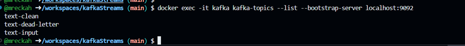
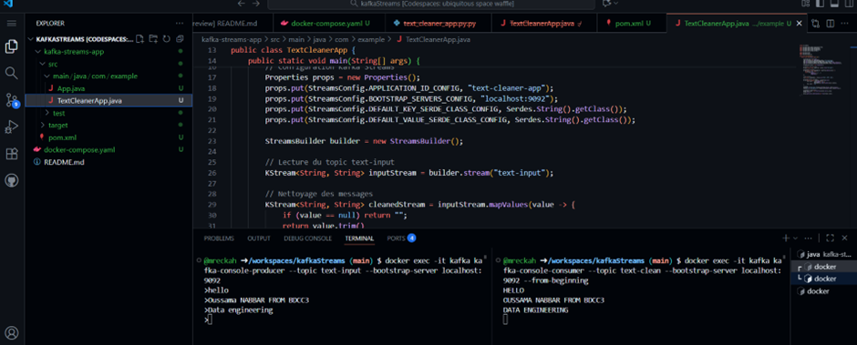
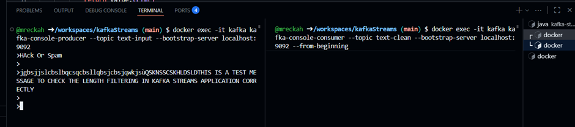
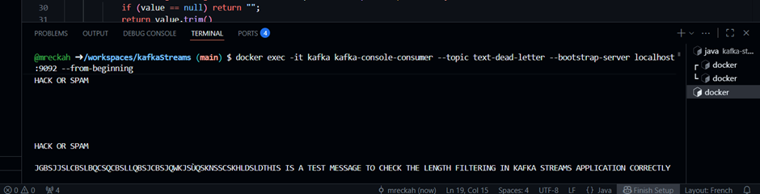
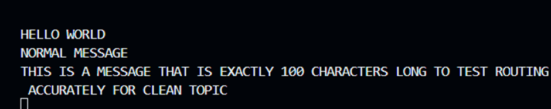

# Kafka Streams – Text Cleaning Application

  

This project implements a Kafka Streams application that cleans, filters, and routes text messages.

---

## 1. Topics to create

* `text-input` – input topic
* `text-clean` – valid cleaned messages
* `text-dead-letter` – invalid messages

---

## 2. Read messages

* Read from `text-input` topic.
* Each message is a string.

---

## 3. Clean messages

* **Trim** spaces at start/end
* Replace multiple spaces with one
* Convert to uppercase

---

## 4. Filter messages

* Reject empty or only spaces
* Reject forbidden words: HACK, SPAM, XXX
* Reject messages > 100 characters

---

## 5. Routing

* Valid -> `text-clean`
* Invalid -> `text-dead-letter`

---

## 6. Test

1. Start Kafka and topics.
2. Start the app.
3. Send messages to `text-input`.
4. Check `text-clean` and `text-dead-letter` for correct routing.

---

## Conclusion

* Shows Kafka Streams basic processing.
* Clean, filter, and route messages.
* Valid and invalid messages separated by topics.

